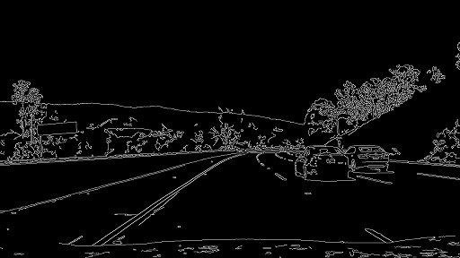
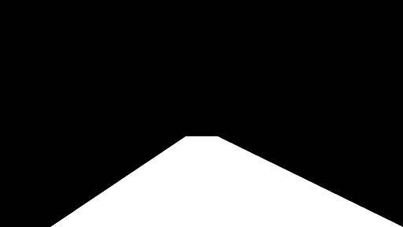
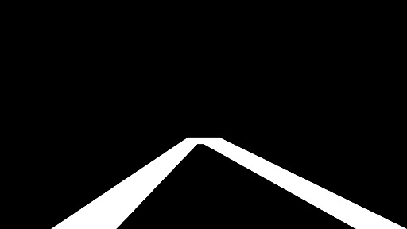
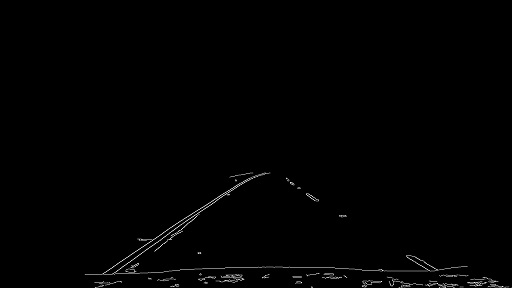
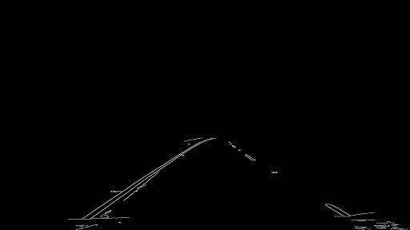
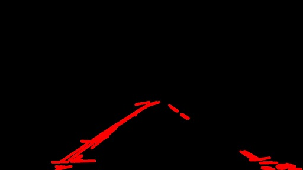
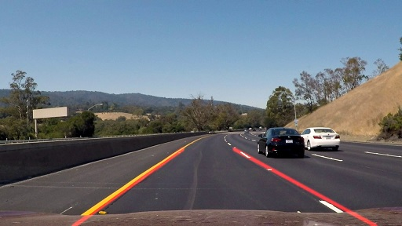

# **Finding Lane Lines on the Road** 

### A complete full autonomous driving vehicle requires multiple technologies for its implementation. As the first step, the cars need to be able to identify lanes lines. Lets see how its done!

---

**Project goals**
* Identify the steps for lane line recognition
* Create a simple pipeline to process images 
* Test the pipeline with some real road images

---

### 1. Pipeline Description

The basic process of the pipeline is:

    * Identify the edges of the elements in the image

    * Define a region fo Interest where to search for the lane lines

    * Select the lane lines and apply them to the image
    
To ilustrate each of the stages of the pipeline, the following image will be used:

***Figure 1***

Lets take a deeper look at each stage.

#### Identify the edges of the elements in the image

Image processing can be resource consuming, it is important to reduce as much unnecessary information from the image as possible while keeping the important data to be processed.
For this purpose, the color image is removed by converting the image to a grayscale. This reduces the image footprint and leave the image with only one channel to process, RGB has 3, one for each color.

Next the image is blurred with a Gaussian blur function. This helps to remove more details from the image. Solid lines in the image will still remain but
other fine lines such as road imperfections and fine contours can be potentially eliminated

With the noise reduction performed, the edges of the elements inside the image can now be identified using the canny algorithm. The canny algorithm detects the strongest
gradients in the image and futher eliminate the noise. The canny algorithm can de tuned with by providing a high and a low pixel thresholds. Pixels above the high threshold are marked as 
strong edge pixels, while pixels between thresholds are marked as weak. Below the lower threshold, pixels are discarded.

Processing Image one up to this point will give us the following result:

***Figure 2***

### Select a region of Interest where to search for the lane lines

As the camera in a car is in a fixed position, the lane lines will be found in a certain position with respect to the car. After removing most of the noise of the image
an area of the image can be specified to look for the lines. This calibration should've done per vehicle basis. This area will be called **'region of interest'**.
The **region of interest** for this pipeline has a trapezoid shape. The selected area looks as follows:

Again, the values for the trapezoid were selected empirically from the given examples. Most of the times the values used are a percentage of the image width and height. For example, 
the extent of a lane line to the horizon is a 40% of image height from the bottom. The base of the trapezoid are based on eighths of the width of the image. The left
bottom is at x=1/8, y = image height while the right bottom is at  x=7/8, y = image. On the other hand the top of the polygon was set by using an 50 pixel offset from half width of image size
to either left and right.
This region of interest covered perfectly the area where the lines were located, but for some images this region will still contain other lines inside the region
from color changes on the floor. For this reason reason the trapezoid had to be hollowed-out. Here is now the selected region of interest with an inverted "U" shape:

***Figure 3.2***

Now, we can apply use this image as a mask for the image in figure 2. The value of each pixel in figure 2 will be "and"-ed with the mask and only the pixels in the 
**region of interest** will remain. Here is the result of this operations. In figure 4.1 using the whole trapezoid and in figure 4.2 using the hollow trapezoid:

 &emsp;&emsp;&emsp;

***Figure 4.1***
        &emsp;&emsp;&emsp;&emsp;&emsp;&emsp;&emsp;&emsp;&emsp;&emsp;&emsp;&emsp;&emsp;&emsp;&emsp;&emsp;
        &emsp;&emsp;&emsp;&emsp;&emsp;&emsp;&emsp;&emsp;&emsp;&emsp;&emsp;&emsp;&emsp;&emsp;&emsp;
***Figure 4.2***

As you can see the lines belonging to the front of the car are not present in Figure 4.2, improving eliminating another source of noise.

### Select the lane lines

By now, most of the pixels that cannot be part of the lane lines has been removed. Its time to identify the lines. A line in a 2D coordinate map can be describe
by a pair of points x1,y1 and x2, y2. Inside the region of interest we have several points and lines some of them belong to the lane lines some other not.
To identify each one, we made use of the representations of the points in hough space. Each line  can be  described by a the ecuation:

    y = xm + b

once you identify the gradient (m) and the y-intercept we can calculate points outside the original points that follows the line. A line such as this can be the 
lane line, but how we get here? The line can be also represented in hough space with b and m axis. In this space a line is represented as a single point, as in the equation
all points of a line can be calculated from m and b. So we need to identify the lines that crosses a single point in the b and m axis, as they will belong to the
same line in the x and y coordinate system.For this purpose we use the houg lines algorithm over the image 5. This algorithm uses the following input paramerets:

    * Distance between the point to be considered a match

    * Resolution of the coordinates in hough space

    * Minimum number of points that can be considered a line in hough space

    * Gap between the nearest points that can still be considered part of a line.

Applying this method we get the following image:

***Figure 6***

In this image there are still gaps between the lane lines. One thing that can be done is to connect the separated lines that correspond to the lane lines
and make a straight line that covers up to the bottom of the image. 
But, how we identify wich lines to connect? In other words which lines belong to the left and right side? Which ones are **NOT** lane lines?
The answer is by using the m value mentioned before. For each line we can calculate the gradient and from it, the the angle of the line (arctang(m)) and determine if they belong to the left or right lane line. 
For the left line a good range I found based on the examples was lines with a 25 and 65 degree. As the y axis is inverted ( 0,0 coordinate is at top left corner )
we invert the angle values resulting in -25 & -65 degrees for the left line, and 25 to 65 degrees for the right line as is a "mirror" of the left.
Once we have all the lines from the left and right lanes, we can use linear regresion using all the points to find the final line for each side.
In Python the numpy library has the polyfit function that can serve this purpose. The result from this function will be the gradient and  y-interceptor
that best matches all the points, one set for left, one for right.

Now is just a matter to use these values with suitable x and y. 

The y lower value is same for both side and is the heigt of the image.
The y upper value is also the same, and is at the 60% of the image height. 

For x we rearrange the line equation like this:

    x bottom coordinate = y lower value - y -intercept / gradient

    x top coordinate = y upper value - y -intercept / gradient

Using the respective values for either left or right lines.

Finally, the extrapolated lines are blurred to have a better effect and the result is blended with the original image. The result is:

***Figure 7***

All of this methods are found in the find_lane_lip.py library. Another utility method to test the pipeline is included:

* *process_directory* - Process all jpg or mp4 images in a given directory and save the results in the specified output directory

### 2. Current Potential Issues

After this first approach to identify the lane lines, there are some open points that need to be addressed:

* Additional checks when no lines can be identified. I experience this problems in the drawlines function, but they were corrected
  with a tunning in the gaussian blur, cany and hugh lines parameters. But what the pipeline should do if no lines are detected?
  
* The starting/ending of a line is determined if they do not cross the  middle size of the frame. So an increasing line detected in the left side 
  cannot go beyond the half width of the frame's size. This can be a problem in a more curvy road which is not part of the current scenarios. This also
  includes corners ion streets.
  
* The lines are extrapolated to the horizon based on a calculated average of the videos presented, but ideally we could try to identify the horizon to extrapolate the lines
  more accurately, according to the situation

* Line detection when changing lanes. When chaning lanes the gradient of the lines detected will become zero. This is not a case covered by the current pipeline as
  they are discarded from the current implementation to reduce noise.

### 3. Further Pipeline Improvements

At the top of my head these are a few improvements that can be done, although some others might be done as well.

* **Averaging lines between frames.** The road will probably not change drastically between three or four frames. To avoid the problem of not recognizing lines in one frame 
   we could make an average of the least 3 frames in case a line cannot be detected in one frame. This mechanism can be extended  with a threshold indicating how many 
   frames without a line lane recognition can be assumed safe, for example.
 
* **Horizon Identification.** As mentioned in the Potential Issues we could try to identify the horizon, using  a similar techniqe to lines identification. Define a region of interes to look for a strong horizontal lines,
  or the change when multiple lines are defined (mountains, cars, in the horizon) and where no lines are identified (the sky). Then some heuristic will help to determined
  up to whcih point the lines will be extrapolated below the horizon.
  
* **Image Tunning.** Maybe the image can be tunned by modifiying the constrast, brightnes or other parameters and the cany method can identify lines more acurately.
  I try to do that before converting the image to gray, but it worked for some images and not for others (no lines detected). The tellow lines are also difficult to detect
  when converted to grayscale, maybe we can convert the image toa  different set of colors, that contrast best the yellow line, get the canny iage , and blend it with the one 
  obtained from grayscale. This is a point to investigate if it could be useful.
  
* **Adjust parameters according to brigthnes of the image.** If the image is too bright lane lines are hard to detect. After converting the image to gray, the image can be 
  tuned to a lower brightnes/constrast if the  average of the pixels passes certain threshol. This is related to the prevous point.
  
* **Identify curvy roads.** The videos are mostly straight, and so does lines. The challenge.mp4 video suffers because the points detected describe a straight line
  Need to find a better algorithm for all kinds of roads
  
* **Code Implementation Improvements.** This is my first python project and Iam still learning the language. It my be possible to reduce the number of lines of code resulting
  in a more efficient implementation.

   

